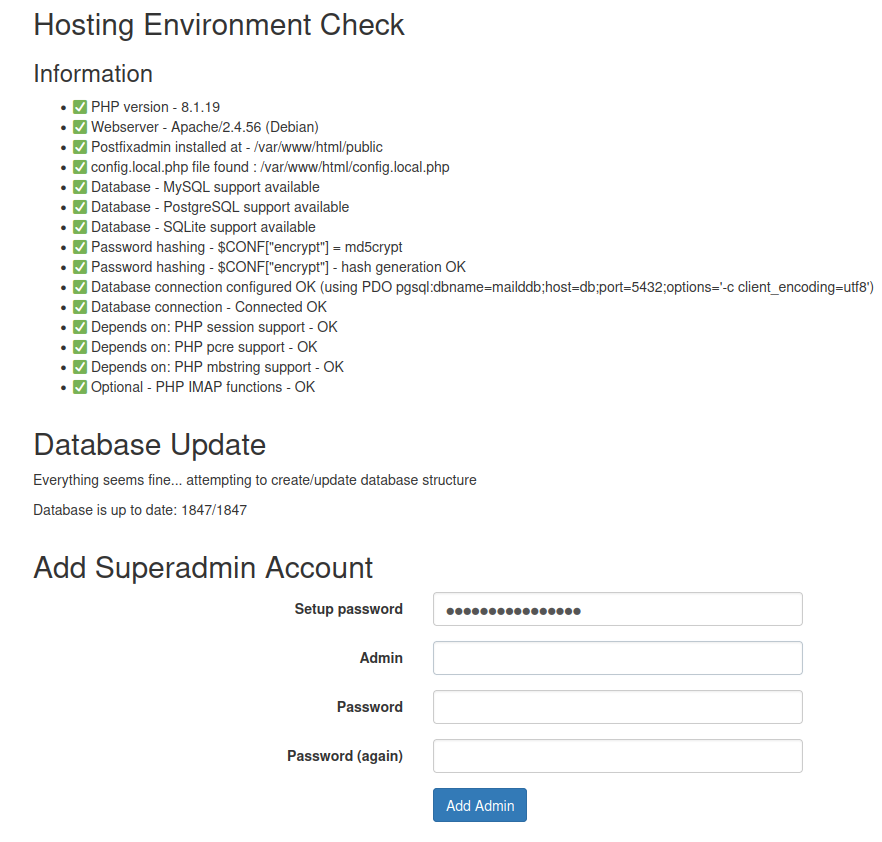

# MailD detailed install instructions

There are two ways of setting this up, from scratch/local and from docker hub; but both has some requirements:

## Requirements

- A valid `docker` and `docker compose` plugins installed.
- Access to dockerhub to pull images; in some envs [Cuba, cough!] or when you are behind a proxy you need extra steps to make it work. That is out of the scope of this guide: google it!
- Access to an ubuntu repository to pull packages for the install.
- The mailserver in where you go to install this solution must have a unique hostname shared with the "email server" and will be tied to the first/default domain you install it; further domains must use the nameserver of the first domain as server.
- According to above one, you need too fix/setup SPF/DKIM/DMARK for every email domain pointing to the hostname of the first domain.
- We use `maild.cu` as example, let´s say `mails.maild.cu` is the name of the default domain host, if you setup a second or third domain, for example `noobster.cu`: this one must be registered on the DNS with `mails.maild.cu` as mail server and all the SPF/DKIM/DMARC/SRV/etc DNS registers must poit to `mails.maild.cu`.

## Some tech details you need to know

1. Docker Volumes

This stack uses docker volumes to share data, so any persisten data will be handled by a docker volume.

2. SSL Certs & HTTPS

This stack generate a self signed certificate if a Let's Encrypt one is not found on the host [For the MTA & MDA use]; setting up the Let's Encrypt cert is out of the scope, google it.

We don't handle any Secure Layer (SSL/HTTPS) on the web servers, that's up to you, we recommend a reverse proxy handling this, Traefik or Nginx, for example.

This said, the webmail will listen on port 80 and the web admin interface will listen on port 8080.

3. Snappy Mail is the default webmail or server, it´s on active development and has a live community, that's why my choice for it; if you don't like it and want to uses another, just comment/change the webmail service on the matching docker compose file.

4. Postfix Admin as the admin web interface for handling domains and users is the default choice, it's open, free, slim and effective. Some features you may not know, buy you will need it:

- Import tools, you can import domains and users from csv files, google it.
- You can create admins for specific domains, to delegate the admin rights of that domain only.
- Others...

5. The maildir folder is fully compatible with MailAD and Docker-MailAD, just a note: users maildirs will be contained  under a folder with the name of the domain. This will ease the migration from one to the another.

## Install it from dockerhub

1. Copy the `env.sample` file to `.env` file and tweak/change/update the configs to your needs.
2. Review the `vars/` dirs to check if you need to tweak any service variable.
3. Install it like this:

```sh
you@yourpc:~/$ docker compose -f compose-dockerhub.yml pull
you@yourpc:~/$ docker compose -f compose-dockerhub.yml up
```

4. Now Go to the [Server Setup](#server-setup) section and do the config, and came back when done.
5. Ctrl+C to stop the inline server, and run it for good on the backgound:

```sh
you@yourpc:~/$ docker compose -f compose-dockerhub.yml up -d
```

That's it.

## Build & Deploy from scratch/local

In this case you are building the whole images and so:

1. Copy the `env.sample` file to `.env` file and tweak/change/update the configs to your needs.
2. Review the services dirs to check if you need to tweak any service variable.
3. Build it:

```sh
you@yourpc:~/$ docker compose pull
you@yourpc:~/$ docker compose build
```

And wait for the build to end.

4. run it:

```sh
you@yourpc:~/$ docker compose up
```

4. Now Go to the [Server Setup](#server-setup) section and do the config, and came back when done.
5. Ctrl+C to stop the inline server, and run it for good on the backgound:

```sh
you@yourpc:~/$ docker compose up -d
```

### You are set, but what about local repos?

If you like to use local repos to speed up things you need:

1. A local OS repos to pull packages for the install, for:
  - Ubuntu Jammy/22.04 LTS
  - Debian Bookworm/12
2. Modify the following files to match your repo's URLs and details:
  - sources.list_debian
  - sources.list_ubuntu
3. Run the `setrepos.h` script with no parameter to setup the local repos, and with any parameter to remove them.

That's it.

## Bonus tracks: Gitlab & traefik

If you like to manage it on a Gitlab CI/CD there is a sample `.gitlab-ci.yml` file on this repo and a `env.sample_gitlab` for your to read; note that gilab flow uses the `compose-gitlab.yml` file as target, so rename it as docker-compose.yml and you are for a go.

Also, the gitlab config is tweaked to use traefik, so there is some labels there to make it work.

# Server Setup

## Setup instructions

After successfully starting it for the first time you need o initiate the DB config, peace of kake:

If you ended with the admin container mapped to (for example) https://mails.domain.com you need to point your browser to: https://mails.domain.com/setup.php, to do the one time setup.

You need to find the OTP setup password in the container `maild-admin`'s logs, this password is a one time password and will change with **EACH reboot** of that container. It will look like this on the logs:

```sh
[...]
#################### !!! #############################
OTP SETUP PASSWORD: RanDomStringThatChangesEveryReboot
#################### !!! #############################
[...]
```

Once you have entered the setup password it will make some checks and then you need to create a superadmin account, using the setup password in the first field.



Use the setup password to create a superadmin account, it must be a valid email address of the default domain, please be careful and observe the warnings in red; take into account that **this is not a real email mailbox** even when it looks like one, you may create the mailbox for that email if needed later in the setup process.

**I repeat:** *This admin account is NOT a mailbox, and will have a different password storage place if you create a mailbox with that name. So you can end having the admin with one password and a real mailbox with ANOTHER password.*

## Domain setup

After ending the setup, go to the login page https://mails.domain.com for example, and create a new domain:

- Add the superadmin mailbox if needed [the superadmin account is the one you created in the setup phase]
- Review the email aliases (postmaster/abuse/hostmaster) and edit it if needed.
- Start to add users to the domain, you can import users in bulk using the PostfixAdmin tools, google it, its easy.

Done, if you ran the docker stack in inline mode [as for this setup above], go back and finish that you have steps to do yet.
