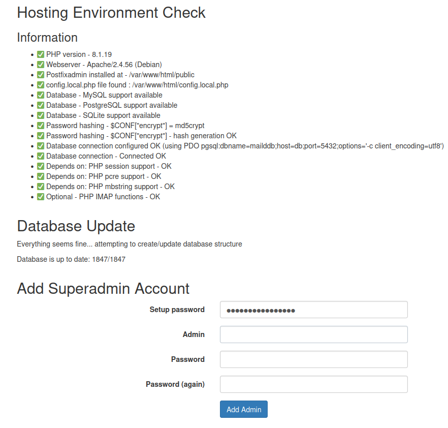

# MailD docker version of the MailAD project but using a DB as backend

This project is inspired on [MailAD-Docker](https://github.com/stdevPavelmc/mailad-docker), that is also based on [Mailad](https://github.com/stdevPavelmc/mailad).

This is the docker version with a DB as a backend instead of a domain controler LDAP we have a [telegram group](https://t.me/MailAD_dev) to discuss the development, feel free to join.

## How to test it?

Just setup a valid docker & docker-compose env, clone this repository, move to it's root folder and do this:

1 - Edit the .env fiile with your domain and passwords for the services.
2 - Review the vars folder for details on each service. 
3 - once you are done, run `docker-compose up` to deploy the services.
4 - Done! just kidding, yo need to finish the setup of the server, got o the Setup Instructions below.

## Services

To create a realy dynamic setup we split the mail server in services:

- [**MTA** (Mail Transport Agent)](./mta/) this is the Postfix field, basically the reception and dispatching of mails to and form the mail server/users.
- [**MDA** (Mail Delivery Agent)](./mda/) This is the Dovecot field, this has to do with the users checking his mails from the mailbox, quotas, etc.
- [**AMAVIS** (Advanced filtering)](./amavis), it comprises attachments, anti-virus, anti-spam, etc.
- [**ClamAV**](./clamav/) AV scanning solution
- **Postgres DB** this is the database lo hold the users data.
- [**PostfixAdmin**](./admin/) This is a simple Web Management interface
- [**MUA**](./mua/) This is the mail user agent, aka: Webmail provided by [Snappy Mail]()
- [**Cron**](./cron/) This has to deal with scheduled tasks, backups, cleanups, statistics, etc.

Follow the links for each service to get details for each docker image.

Warning!: Under no circumstance change the name of the hostnames, it will break the setup.

## Setup instructions

After starting the success `docker coompose up` you need o initiate the DB config; if you ended with the admin container mapped to (for example) https://mails.domain.com you need to point your browser to: https://mails.domain.com/setup.php, to do the one time setup.

You need to find the setup password in the container maild-admin logs; this password is a one time password and will change with EVERY reboot of that container. It will look like this on the logs:

```sh
[...]
#################### !!! #############################
OTP SETUP PASSWORD: NzBmYzAxOTQ1YzlkYzlkMzlmZWI2ZDUy
#################### !!! #############################
[...]
```

Once you have entered the setup password it will make some checks and then you need to create a superadmin account, using the setup password in the first field.



Use the setup password to create a superadmin account, it must be a valid email address of the default domain, please be careful and observed the warnings in red; take into account that this is not an email mailbox, you will need to create the mailbox if needed later in the setup process.

I repeat: this admin account is NOT a mailbox, and will have a different password if you create a mailbox with that name.

## Domain setup

After ending the setup, go to the login page https://mails.domain.com for example, and create a new domain:

- Add the superadmin mailbox if needed [the superadmin account is the one you created in the setup phase]
- Review the email aliases (postmaster/abuse/hostmaster)
- Start to add users to the domain

# Contributing.

There are many ways to contribute:

- Review this documentation and fix typos, syntax errors, propose better sentences, etc.
- Propose translations for some of the .md files (Any langs, Spanish, German & French are the most commons, but any will work.)
- Test this setup on dev premises, spot and report/suqash bugs, propose new features/fixes, etc.
- Spread the word about it
- Join to the [telegram group](https://t.me/MailAD_dev) and give some feedback/kudos to the dev.
- Buy the dev a coffee/beer/beef/mouse/? see [this link to know how to send money to the dev](https://github.com/stdevPavelmc/mailad/blob/master/CONTRIBUTING.md#direct-money-donations) to keep it going!
